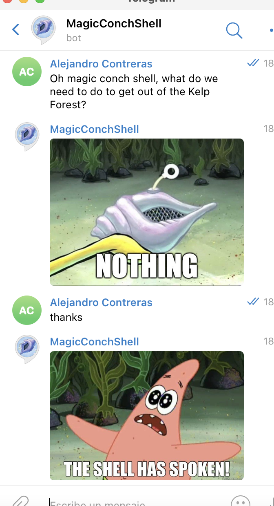

# Magic Conch Shell

> A "Magic 8-Ball" parody on Telegram

 
 

## Building a bot

This is the last project for the Microverse Ruby course. The main objective of this project was to build a bot on a platform. In my case, on Telegram. To accomplish this, I applied the knowledge that I acquired during this module.

My inspiration was a show called "SpongeBob SquarePants." You may know about it. There is an episode where they use this "Magic Conch Shell" as a parody of the classic "Magic 8-Ball."  It is a toy used to cast fortune or seek advice. So, you ask a simple question, and you receive a simple answer. 

That being said, the usage of this bot is pure fun. So please, don't take the answers too seriously. :)

The interaction with this robot will be via Telegram. Message by the message you will send your question and receive your answer.

As the questions must be simple, the only available are: "yes" / "no" / "or" type. 

- "Magic Conch, will I ever get married?"
- "Should I cut my hair?"
- "Should I drink water or coffee?"
- "Do you like my shoes?"

"What" / "Where" / "Who" / "When" / "Where" / "How" / "Why" type are NOT available. If you use one of those, you will receive a "Try asking again" message. (There is a little easter egg that will give you the same answer)

- "Where is that?"
- "How can I get it?"
- "Who did this?"

As another characteristic, if you ask what you should do? You will always receive the answer nothing. (Yes, another little easter egg)

Additionally, you can tell the bot "Thanks" / "Bye" and "Goodbye." You will also receive a reply.

 
 

## Installation

This project is a digital version of this fun toy. To run it, you must have access to a terminal. If you don't know what it this, [click here](https://launchschool.com/books/command_line/read/introduction) for more information about this topic. :)

Also, you must have ruby installed on your computer. If you don't have it but wish to, [click here](https://www.ruby-lang.org/en/documentation/installation/) for the instructions.

In the same way, a [GitHub](https://github.com/) account. 

Once you have all this, at first, you have to clone the repository, [here](https://docs.github.com/en/github/creating-cloning-and-archiving-repositories/cloning-a-repository) you can find out how to make this possible.

Hold on here! Now, you need a Telegram token to run the program. Fortunately, it is simple! Just install the Telegram app on your computer (if you don't have it already) and follow [these](https://www.siteguarding.com/en/how-to-get-telegram-bot-api-token) simple steps.

Inside the Ruby-capstone folder that you just cloned from Github, open with the text editor (right-click -> open with -> TextEdit)

Now in the [token = ''] line, copy your token inside the ''. e.g. token = 'YOUR-TOKEN-HERE'. And save the file.

Now that you have the repository in your local machine. Change the direction of the local file with your terminal. Just open the Terminal, type "$ cd" (without the $ sign), and the path to reach the Ruby-capstone/lib folder.

e.g. "$ cd User/Documents/Ruby-capstone/lib"

You are done! Now to run the code, just type "$ ruby bot.rb" and open Telegram. In the searcher look for MagicConchChell (user @ConchNo4Bot) and send it a message. 

Have fun!

 
 

## Built With

- Ruby 3.0.0
- VSCode
- Git
- Telegram API

 
 

## Getting Started

**Please, before starting, verify that you accomplish the Requirements to continue.**

To get a local copy up and running follow these simple example steps.

### Prerequisites
- Ruby 2.6.0 or a later version.
- Access to a Terminal (and basic knowledge on the usage)
- GitHub account
- Telegram API token

### Setup

- Clone this repository into tour computer
- Get a Telegram API token
- Set the token in the bot.rb file

### Usage
- In your Terminal, change the direction to the folder you just cloned, to the lib folder.
- Run the script file using the ruby bot.rb 
- Open Telegram and look for the MagicConchShell bot
- Have Fun!

## Author

👤 **Author1**

- GitHub: [@AlejandroNo4](https://github.com/AlejandroNo4)
- Twitter: [@Alejand80002666](https://twitter.com/Alejand80002666)
- LinkedIn: [Alejandro Contreras Rodriguez](https://www.linkedin.com/in/alejandro-contreras-rodriguez-b524821b5)

## 🤝 Contributing

Contributions, issues, and feature requests are welcome!

Feel free to check the [Issues page](https://github.com/AlejandroNo4/Tic-Tac-Toe/issues).

## Show your support

Give a ⭐️ if you like this project!
